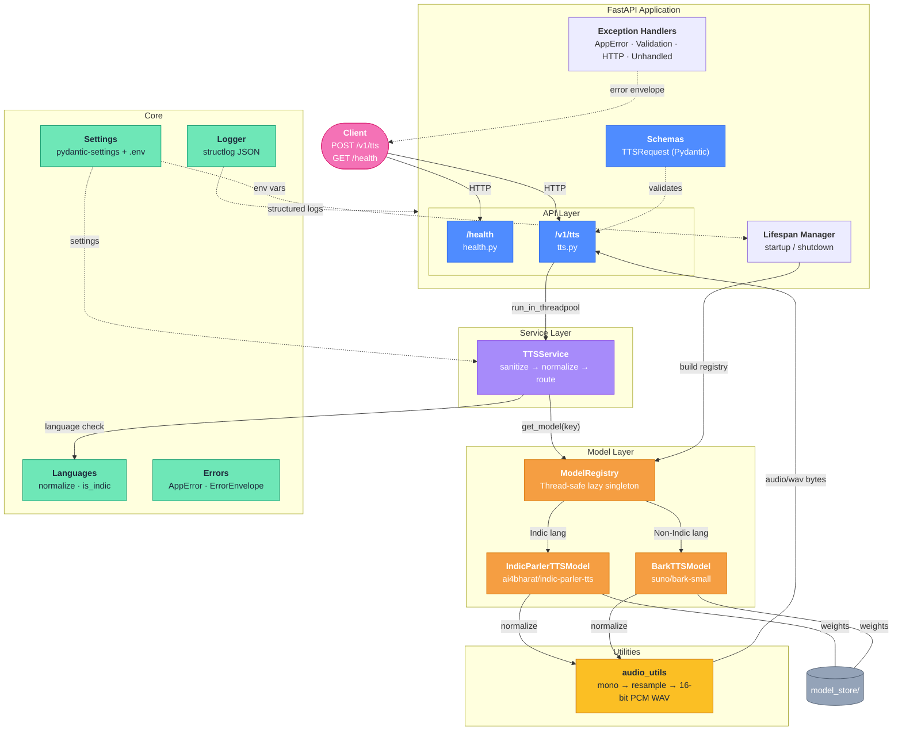

# TTS Inference Service

Phase 1 TTS microservice exposing `POST /v1/tts` and returning `audio/wav`.

Indic languages route to Indic-Parler-TTS. Non-Indic supported languages route to Bark. Inference is run off the FastAPI event loop through a worker thread.

## Features

- `GET /health`
- `POST /v1/tts`
- Indic routing to `ai4bharat/indic-parler-tts`
- Non-Indic routing to `suno/bark-small`
- Singleton model registry with lazy loading
- Optional startup preload and warmup
- Structured JSON logging
- WAV normalization to one-channel 16-bit PCM
- Docker support

## Architecture



**Request flow:** A client sends a POST to `/v1/tts`. The route validates the payload via Pydantic, then offloads work to a **worker thread** (`run_in_threadpool`). The `TTSService` sanitizes the text, normalizes the language code, and routes to either **Indic-Parler-TTS** or **Bark** through the thread-safe `ModelRegistry`. Model wrappers produce raw audio which is normalized to **mono 16-bit PCM WAV** by `audio_utils` before being streamed back as `audio/wav`.

## Supported Languages

Indic: `as`, `bn`, `brx`, `doi`, `gu`, `hi`, `kn`, `kok`, `ks`, `mai`, `ml`, `mni`, `mr`, `ne`, `or`, `pa`, `sa`, `sat`, `sd`, `ta`, `te`, `ur`.

Non-Indic: `ar`, `de`, `en`, `es`, `fr`, `it`, `ja`, `ko`, `nl`, `pl`, `pt`, `ru`, `tr`, `zh`.

## Local Development

```bash
python3.11 -m venv .venv
source .venv/bin/activate
pip install --upgrade pip
pip install -r requirements.txt
cp .env.example .env
```

For a lightweight health check without loading large model weights:

```bash
LOAD_MODELS_ON_STARTUP=false python run.py
curl http://localhost:8000/health
```

Download model weights into `model_store/`:

```bash
chmod +x scripts/download_models.sh
./scripts/download_models.sh
```

Run with model loading and warmup:

```bash
python run.py
```

## API

Health:

```bash
curl http://localhost:8000/health
```

TTS Hindi:

```bash
curl -X POST http://localhost:8000/v1/tts \
  -H "Content-Type: application/json" \
  -d '{"text":"नमस्ते","language":"hi"}' \
  --output hindi.wav
```

TTS English:

```bash
curl -X POST http://localhost:8000/v1/tts \
  -H "Content-Type: application/json" \
  -d '{"text":"Hello, this is a Bark sample.","language":"en","voice":"v2/en_speaker_6"}' \
  --output english.wav
```

Request body:

```json
{
  "text": "नमस्ते",
  "language": "hi",
  "voice": "optional voice description or Bark voice preset"
}
```

Success response:

```text
Content-Type: audio/wav
```

Error response:

```json
{
  "error": {
    "code": "validation_error",
    "message": "Request validation failed.",
    "details": {}
  }
}
```

## Voice Options

For Indic-Parler-TTS, `voice` is treated as a natural-language voice description. If omitted, the service uses a neutral Indian studio voice description.

For Bark, `voice` is treated as a Bark voice preset such as `v2/en_speaker_6`. If omitted, the service uses `DEFAULT_BARK_VOICE`.

## Latency Notes

The first request is slower when a model is loaded lazily. In production, keep `LOAD_MODELS_ON_STARTUP=true` and `WARMUP_ON_STARTUP=true` so the service preloads and warms both models during startup.

GPU with fp16 is recommended for Indic-Parler-TTS and Bark. CPU can work for validation but is not recommended for production latency.

## Tests

```bash
pytest
```

Tests use mocked model wrappers, so they do not download weights or require a GPU.

## Docker

```bash
docker build -t tts-inference-service .
docker run --rm -p 8000:8000 --env-file .env -v "$PWD/model_store:/service/model_store" tts-inference-service
```
